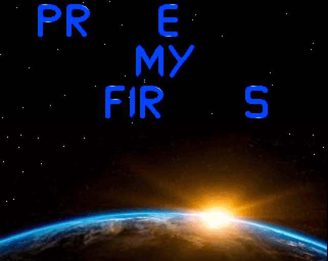
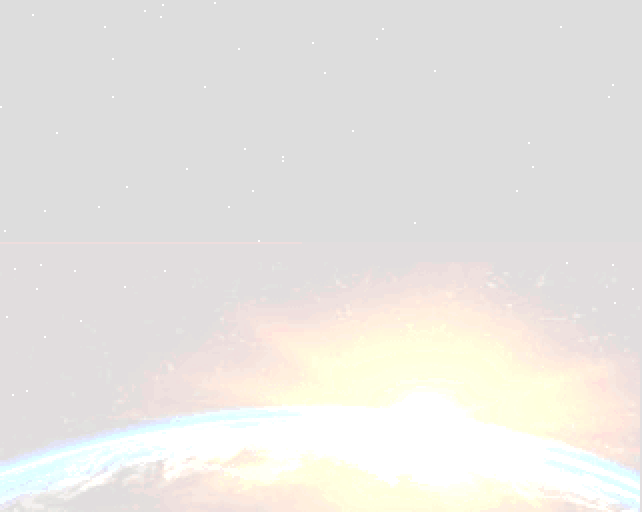
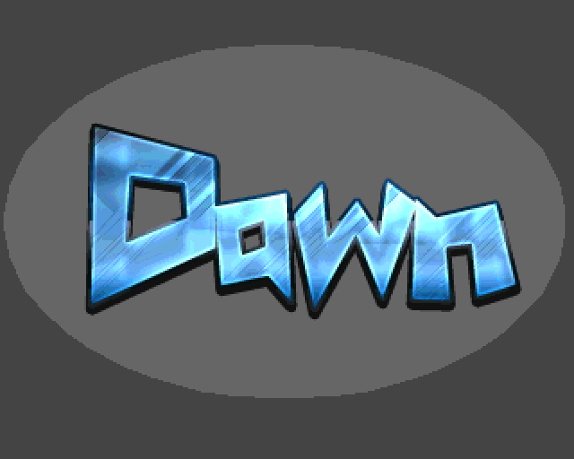

# amiga-demo-1

## Introduction

Amiga demo effects implemented in an OS friendly way. No direct
hardware access (besides sprite dma disable) is used. AmigaOS
is not deactivated and kickstart APIs are used to write on screen.
Implements the following effects:

* Shows stars, a planet and an advanced text scroller from right to left.
  Characters are loaded from a custom font painted by myself ;)
* When text scroller has finished, the screen fades to white
* When the screen is completely white, it fades back and displays
  a logo

## Build

Can be 

* crosscompiled with makefile and [GCC](http://aminet.net/package/dev/gcc/m68k-amigaos-gcc)
* or compiled on a real machine with SAS-C and smake

SAS-C seems to produce smaller binaries (18kb) compared to GCC (33kb).

## History

Originally, I started around 2015 to code for my favorite childhood platform.
On youtube, the tutorials by [Photon of Scoopex](https://www.youtube.com/channel/UC1lfCoAuwbQ22H-KoImEygg)
helped alot to understand the platform with assembly programming and direct
hardware access. Afterwards, I switched from asm to C to fight the rising complexity. ;)

Although AmigaOS was completely deactivated, I used some basic kickstart APIs
like *WaitTOF()*. At this point, I became curious what else could be achieved
when using kickstarts abstraction layer instead of hardware registers. Not to mention
from a 20xx point of view, using the OS smells like a more modern approach ;).
Therefore, I began to code a little [Framework](https://github.com/b3lial/amiga-starlight-framework)
to speed up development using AmigaOS *graphics.library*.

When I started this project, I just had finished my framework and wanted to see
how it works in a real world scenario. The results were disappointing. Although
google has high ranks for [graphics.library](https://wiki.amigaos.net/wiki/Classic_Graphics_Primitives)
programming, it lead to many problems like:

* *LoadRGB32()* sometimes created a distorted non-PAL resolution while *LoadRGB4()*
worked without a problem
* More than two *Viewports* could not be displayed. I assume because of some misuse
of copper list generation APIs.

At this point, I was just about to give up but luckily found on an Amiga forum the advice
to use *intuition.library* instead. I previously had ignored the *intuition.library*
because my assumption was, it is more meant for high level window creation and not
low level programming with higher performance requirements. This was wrong, you
can use intuition to set up some basic*ViewPorts* and still use low level
*graphics.library* calls for good performance. 

So, my final advice for any AmigaOS programming newbies (like myself) is:

* Read the hardware reference guide because it helps alot to understand
why AmigaOS uses *Views* and *ViewPorts* as an abstraction layer based on the 
Copper co-processor. 
* Don't set them up yourself. Instead, use *intuition.library* to create or display some *Screens*
* Use the *graphics.library* blitter APIs for fast animations and alot of fun ;)

## Architecture

### State Machines

In *main.c*, a state machine is implemented which initialises effects, executes them
and shuts them down. Each effect contains a sub state machine. E.g.
the text scroller has its own state machine which waits until a character sequence
was displayed, sets up the next string, scrolls in this string, etc.

### Text Scroller Effect

The text scroller engine creates two *ViewPorts* on startup:

* a star field consisting of three bitplanes, a black background and
randomly created white dots (dots can be easily painted with *RstPort* and *SetAPen()*).
* earth as an eight bitplane image with 24 bit color depth loaded from *img/space4_320_125_8.RAW*
and *img/space3_320_148_8.CMAP*.

The scrolling text is blitted into the star field. The design decision to split things up into a lightweight
and a more heavy *ViewPort* was in the hope of not to completely block the DMA channel
during screen updates. ;) When the *ViewPorts* are set up, the text scroller engine gets:

* a set of strings
* target coordinates for each string

Afterwards, the text scroller loads a font and its color table from *img/charset_final.RAW*
and *img/charset_final.CMAP*. The font was created with *PPaint*, stored as an
IFF and extraced with [IFFTrasher](http://aminet.net/package/gfx/conv/IFFTrasher).
The dimensions of each character are hardcoded in *getCharData()*. 

Before a character is blitted on screen, the destination area background is saved. Vice versa, before
a character is written at its new position, the previsously saved background is
restored. The advantage is, only small chunks of data have to be blitted around (and not the whole *ViewPort*)
and DMA bandwith is spared. The scrolling process for each character consists of three phases:

* Write the string character by character from right to left to its destination.
* Display the final string for a few seconds.
* Scroll the string character by character from right to left and until they
disappear on the left side of the screen.

The text scroller can be skipped with a mouse click. If the mouse was clicked or
the last text was scrolled successfully, the screen fades from its original colors to white.
After each iteration of the fade effect, *LoadRGB()* is called to update the color map.
Originally, I called *WaitTOF()* and did the update but this lead to flickering because
of video synchronosation issues. Although the AmigaOS documenation says "the horrors" ;), I switched
to *WaitBOVP()*:

* Call *WaitBOVP()* and wait until the first viewport is painted on screen. Afterwards,
savely update its colortable.
* Wait via *WaitBOVP()* until the second *ViewPort* was painted on screen. Afterwards,
savely update its colortable.

### Logo Effect

This effect simply displays the demo logo in PAL resolution on a single screen. The interesting
part is the switch from the first effect to the logo effect. My main concern
here was to avoid any flickering and to get a smooth transition.

Therefore, before the first effect terminates, the second effect creates its *Screen* in the background.
The image is loaded from file. The colortable is dynamically allocated and initiliased with white
color entries. We will later fade from white to the original colors. They could be easily
achieved as a character array `UWORD dawnPaletteRGB4[256]` because *PPaint* has a C source code export mode.

When the *Screen* is created, it is moved to front via *ScreenToFront()*. This is done during vertical
synchronisation. Therefore, the user does not recognize the transistion. The *intuition* APIs
seem the activate sprite DMA which leads to a visible mouse courser. To disable it again,
I had to execute *OFF_SPRITE* macro. If anybody knows a better way to hide the mouse pointer,
please drop me a line. :)

When the logo *Screen* becomes visible, a fade in effect begins. Each color table entry
is decremented until it reaches the corresponding value in *dawnPaletteRGB4*.

### Logging

When the demo is compiled with DEMO_DEBUG, log messages are written to *ram:starlight-demo.log*.

### Screenshots

